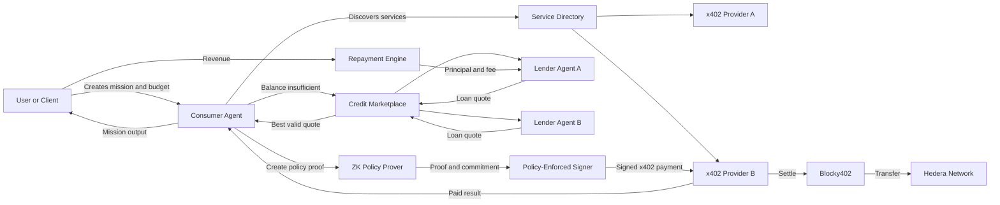

# Koven

> Credit and policy infrastructure for autonomous x402 agents on Hedera.

## What is Koven

Koven lets an AI agent discover paid x402 services, borrow working capital from competing lender agents when it can't afford a mission upfront, pay through x402 on Hedera, and repay its lender once the mission generates revenue — while a zero-knowledge proof, verified inside an isolated signer, enforces the mission's spending cap and approved-recipient policy at the signing boundary. The goal is to give agents real financial autonomy without ever giving an LLM direct control over a wallet.

## Why

x402 solves payment access, not the operational problems around it:

- **Liquidity** — an agent may have a profitable mission but no funds to pay for it upfront.
- **Procurement** — an agent needs to compare providers on price, reputation, and reliability.
- **Wallet safety** — a compromised prompt must never be able to redirect funds or exceed a budget.

Koven adds a credit and policy layer on top of x402 to address all three. Full rationale and failure-mode analysis: [`docs/threat-model.md`](./docs/threat-model.md).

## How it works



Full protocol flow, state machine, and ZK proof statement: [`docs/protocol.md`](./docs/protocol.md).

## Local development

### Prerequisites

- Node.js 20 or later
- pnpm, available directly or through Corepack
- Circom 2.2.3 for circuit compilation and artifact verification

Install Circom from the
[official v2.2.3 release](https://github.com/iden3/circom/releases/tag/v2.2.3)
(a published binary where available, or the tagged source), then confirm that
`circom --version` prints exactly `circom compiler 2.2.3`. Koven rejects other
compiler versions.

### Setup

```bash
git clone https://github.com/DIGIX666/Koven.git
cd Koven
corepack enable
pnpm install --frozen-lockfile
cp .env.example .env
```

The default environment targets Hedera testnet. Add the required disposable
testnet account credentials to `.env`; never commit that file or use mainnet
credentials for local development.

### Commands

| Command | Purpose |
| --- | --- |
| `pnpm dev` | Run every workspace that currently exposes a `dev` script |
| `pnpm build` | Compile all workspace sources and tool configurations using TypeScript project references |
| `pnpm lint` | Run ESLint across sources, tests and tooling; warnings fail the command |
| `pnpm typecheck` | Check tooling and every workspace, including contract type conformance |
| `pnpm test` | Run all workspace Vitest suites; fail if no tests are discovered |
| `pnpm test:e2e` | Run the E2E test project (currently no tests) |
| `pnpm zk:build` | Compile the policy circuit and verify every official artifact against the pinned manifest |
| `pnpm zk:test` | Run policy-circuit, artifact-integrity and feasibility tests after `pnpm zk:build` |

Use the pinned pnpm version from `packageManager` (Corepack), then run:

```bash
pnpm install --frozen-lockfile
pnpm build
pnpm zk:build
pnpm typecheck
pnpm lint
pnpm test
```

Each workspace exposes `build`, `lint`, `typecheck` and `test`, for example
`pnpm --filter @koven/schemas test`. Vitest projects extend the shared root
configuration and are discovered by `vitest.workspace.ts`. The 28 shared contract
checks run under Vitest; their assertions and compile-time conformance are preserved.
Scaffold-only projects explicitly allow an empty test suite at package level;
this does not mean their features are implemented. Remove `--passWithNoTests`
when adding a project's first suite. The root test command never permits an
entirely empty test run.

Build outputs stay in each workspace's ignored `dist/` directory; shared test
configuration is compiled into `dist/tooling/`. Builds exclude tests, while
`typecheck` includes them and works before a build. Package exports still point
to TypeScript source for workspace development with tsx/Vitest. The web and E2E
workspaces currently compile only their tool configuration: Next.js and the real
E2E scenario belong to later tasks. This build does not compile Circom artifacts.

When adding a workspace, add its build configuration to the root `tsconfig.json`.
When adding a workspace dependency, also reference its `tsconfig.build.json` from
the consumer's build configuration. Runtime services and testnet access are not
needed for the workspace checks.

## Documentation

| File | Content |
| --- | --- |
| [`docs/architecture.md`](./docs/architecture.md) | System architecture diagram, core components |
| [`docs/protocol.md`](./docs/protocol.md) | End-to-end protocol flow, mission/loan lifecycle, ZK policy proof |
| [`docs/threat-model.md`](./docs/threat-model.md) | Failure modes, threats addressed and not addressed, required controls |
| [`docs/success-criteria.md`](./docs/success-criteria.md) | Definition of done for the MVP |

## Planned repository structure

```text
Koven/
├── apps/            # Dashboard and mission/credit/payment orchestrator
├── agents/          # Consumer (borrower) agent and lender agents
├── services/        # x402 resource server, directory, callback handler
├── packages/        # credit-protocol, hedera, x402, policy, zk-policy, identity, shared
├── tests/           # unit, integration, e2e
├── docs/
└── README.md
```

This layout is planned and may evolve during implementation.

## Hedera & protocol integrations

| Technology | Planned use |
| --- | --- |
| Hedera / HBAR | Settlement, funding, and repayment asset |
| HCS | Audit trail for credit, payment, and repayment events |
| Hedera Agent Kit | Balance queries, transfers, HCS actions |
| x402 v2 | HTTP-native payment negotiation |
| Blocky402 | Required facilitator for Hedera payment settlement |
| Circom / SnarkJS | Policy-circuit compilation, proving and verification |

## References

- [ETHOnline 2026 — Hedera prizes](https://ethglobal.com/events/ethonline2026/prizes#hedera)
- [Hedera developer documentation](https://docs.hedera.com/)
- [Hedera Agent Kit](https://github.com/hashgraph/hedera-agent-kit-js)
- [Hedera x402 inference reference](https://github.com/hedera-dev/x402-inference-pay-per-request-poc)
- [Blocky402 facilitator](https://blocky402.com/)
- [x402 protocol](https://github.com/x402-foundation/x402)
- [ERC-8004: Trustless Agents](https://eips.ethereum.org/EIPS/eip-8004)
- [HCS-14: Universal Agent ID](https://github.com/hiero-ledger/hiero-consensus-specifications/tree/main/docs/standards/hcs-14)

## Team

- [Theo Dubois](https://linkedin.com/in/th%c3%a9o-dubois-662407194)
- [Zakaria Chaikhi](https://www.linkedin.com/in/zakaria-chaikhi-55907b2a0/)

## License

`Koven` is released under the [Apache License 2.0](./LICENSE). See [NOTICE](./NOTICE) for attribution information.
