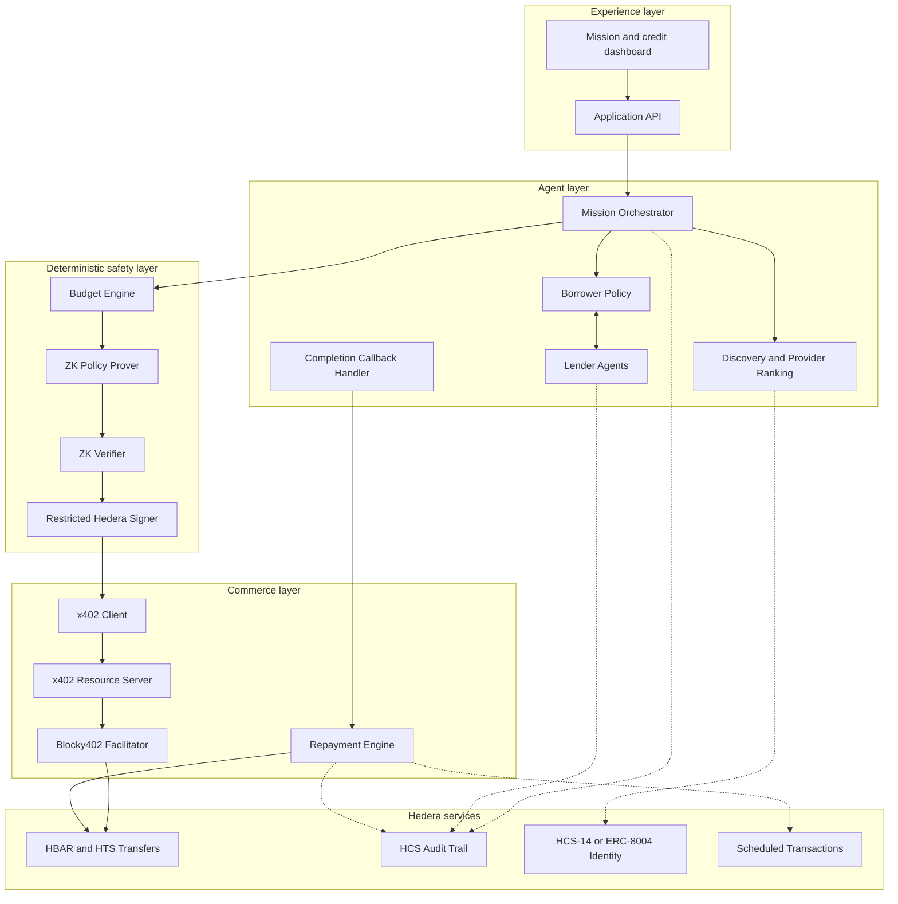

# Architecture

Koven separates probabilistic agent reasoning from deterministic financial enforcement. Agents decide *what* to do; a separate, restricted layer decides *whether a payment is allowed to happen*.

## Core components

| Component | Responsibility | Enforcement type |
| --- | --- | --- |
| Mission Orchestrator | Decompose the mission and coordinate discovery, credit, payment, and completion | Agent reasoning |
| Service Directory | Expose provider capabilities, endpoints, prices, identity, reputation, and latency | Deterministic data |
| Provider Ranker | Score eligible services against mission constraints | Deterministic policy with optional agent input |
| Borrower Policy | Decide whether credit is needed and select a valid offer | Deterministic policy |
| Lender Agent | Evaluate risk and return amount, fee, expiry, and repayment terms | Independent agent plus deterministic limits |
| Credit Marketplace | Broadcast requests and collect comparable signed offers | Protocol layer |
| Budget Engine | Maintain mission and session spending caps | Deterministic enforcement |
| ZK Policy Prover | Prove that a proposed payment satisfies the active policy | Cryptographic proof |
| Policy-Enforced Signer | Verify proof and bind it to the exact payment before signing | Trusted enforcement boundary |
| x402 Client | Handle `402 Payment Required`, sign, retry, and decode settlement | x402 protocol |
| Resource Server | Provide a real metered service protected by x402 | x402 server |
| Repayment Engine | Process mission revenue and repay principal plus lender fee | Deterministic workflow |
| HCS Audit Writer | Publish hashes and references for important lifecycle events | Hedera Consensus Service |
| Dashboard | Display mission state, offers, payments, proofs, and receipts | User interface |

## Design principle

No component in the **agent layer** can authorize a Hedera transaction on its own. Every payment must pass through the **deterministic safety layer**, which does not depend on the LLM interpreting a prompt correctly — it depends only on a verified proof and an isolated signer. See [`threat-model.md`](./threat-model.md) for what this guarantees and what it explicitly does not.