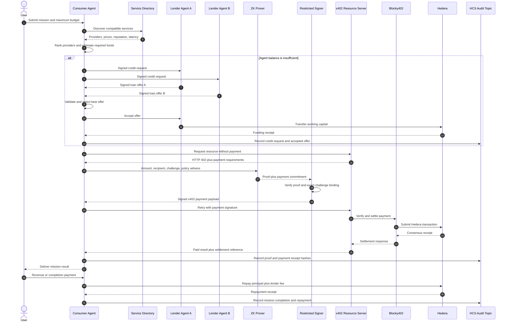
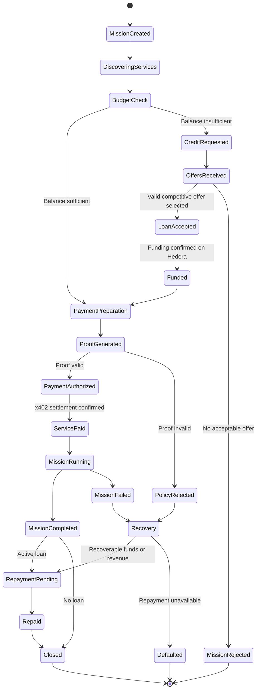
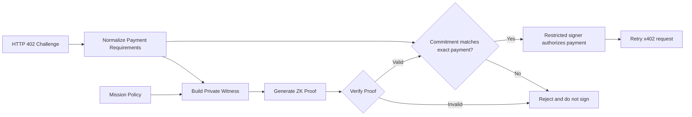

# Protocol

## End-to-end flow



## Mission and loan lifecycle



## ZK spending guardrails

The ZK component is a wallet-safety feature, not a standalone product. Its purpose is to ensure that a compromised prompt cannot convince the signer to violate an approved payment policy.

### Policy rules for the MVP

For every payment, the prover demonstrates:

1. `paymentAmount <= missionSpendingCap`
2. `paymentRecipient` is included in the approved recipient Merkle tree

The proof must also be bound to the exact x402 challenge so that a valid proof cannot be reused for another amount, recipient, resource, or nonce.

### Proposed proof statement

```text
Given:
  paymentAmount
  paymentRecipient
  paymentNonce
  resourceHash
  missionSpendingCap
  approvedRecipientsRoot
  recipientMerklePath

Prove that:
  paymentAmount <= missionSpendingCap
  MerkleVerify(
    approvedRecipientsRoot,
    Hash(paymentRecipient),
    recipientMerklePath
  ) == true
  paymentCommitment == Hash(
    paymentAmount,
    paymentRecipient,
    paymentNonce,
    resourceHash
  )
```

### Enforcement flow



The private key is never exposed to the mission-planning model. Only the restricted signer can authorize a Hedera payment, and it accepts a request only after proof verification and challenge binding.