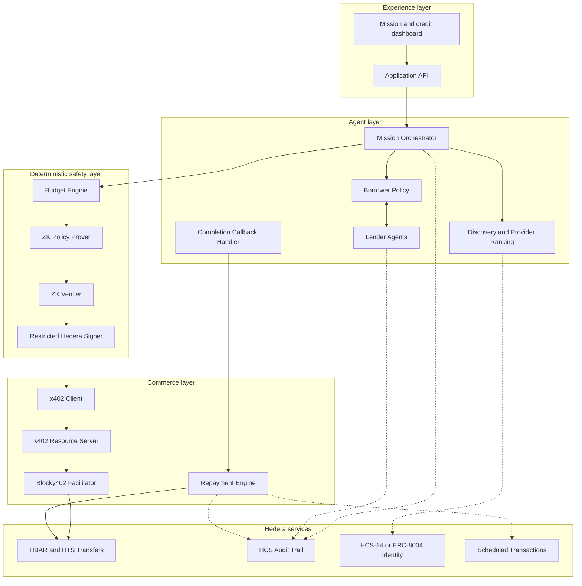

# Architecture

Koven separates probabilistic agent reasoning from deterministic financial enforcement. Agents decide *what* to do; a separate, restricted layer decides *whether a payment is allowed to happen*.

## Core components

| Component | Responsibility | Enforcement type |
| --- | --- | --- |
| Mission Orchestrator | Decompose the mission and coordinate discovery, credit, payment, and completion | Agent reasoning |
| Service Directory | Expose provider capabilities, endpoints, prices, identity, reputation, and latency | Deterministic data |
| Provider Ranker | Score eligible services against mission constraints | Deterministic policy with optional agent input |
| Borrower Policy | Decide whether credit is needed and select a valid offer | Deterministic policy |
| Lender Agent | Evaluate risk and return amount, fee, expiry, and repayment terms | Independent agent plus deterministic limits |
| Credit Marketplace | Broadcast requests and collect comparable signed offers | Protocol layer |
| Budget Engine | Maintain mission and session spending caps | Deterministic enforcement |
| ZK Policy Prover | Prove that a proposed payment satisfies the active policy | Cryptographic proof |
| Policy-Enforced Signer | Verify proof and bind it to the exact payment before signing | Trusted enforcement boundary |
| x402 Client | Handle `402 Payment Required`, sign, retry, and decode settlement | x402 protocol |
| Resource Server | Provide a real metered service protected by x402 | x402 server |
| Repayment Engine | Process mission revenue and repay principal plus lender fee | Deterministic workflow |
| HCS Audit Writer | Publish hashes and references for important lifecycle events | Hedera Consensus Service |
| Dashboard | Display mission state, offers, payments, proofs, and receipts | User interface |

## Design principle

No component in the **agent layer** can authorize a Hedera transaction on its own. Every payment must pass through the **deterministic safety layer**, which does not depend on the LLM interpreting a prompt correctly — it depends only on a verified proof and an isolated signer. See [`threat-model.md`](./threat-model.md) for what this guarantees and what it explicitly does not.

## HCS audit boundaries

Koven stores the complete lifecycle event in the owning service's SQLite
database and atomically appends a public HCS outbox entry. The HCS envelope
contains only the event ID, mission ID, event type, payload hash, timestamp and
an optional transaction reference. Raw reports, signatures, private keys and
local payloads never enter the topic. A durable worker preserves per-mission
order, stores signed transaction bytes before submission, reconciles uncertain
transaction IDs and records the resulting HCS sequence number on the local
event. `AUDIT_SINK=noop` keeps offline tests and local development network-free;
`AUDIT_SINK=hcs` enables publication.

`HcsAuditTrailHook` is attached only to lender funding transfers. The lender
owns that operator key and invokes `transfer_hbar_tool` in
`AgentMode.AUTONOMOUS`, so the hook observes a transaction actually submitted by
Agent Kit. It cannot cover borrower repayment because that key remains inside
the restricted signer, and it cannot cover x402 settlement because Blocky402
submits that transaction. Credit messages, callbacks, repayments and all other
lifecycle facts therefore use Koven's explicit durable outbox. The Agent Kit
hook catches its own HCS failures, so it is additional audit evidence rather
than the recovery mechanism.
