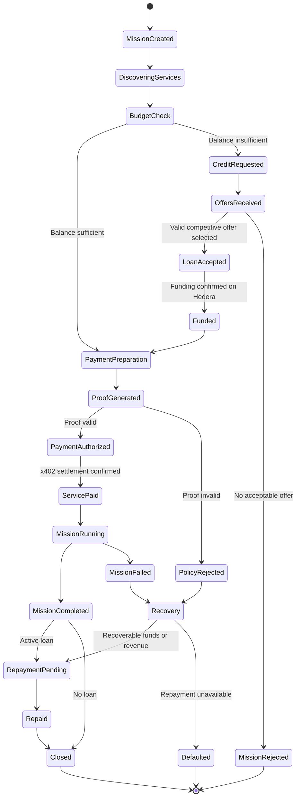
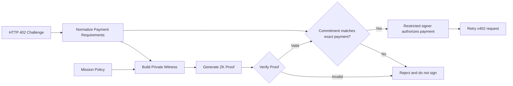

# Protocol

## End-to-end flow

The sequence below is the target M3+ flow. M2 uses the same typed commands
without proof bundles; M4 replaces the single configured provider with ranking.

```mermaid
sequenceDiagram
    autonumber
    actor User
    participant Agent as Keyless consumer / orchestrator
    participant Directory
    participant Signer as Restricted signer
    participant Provider as Scan provider
    participant Prover
    participant Lender as Selected lender
    participant Hedera
    User->>Agent: Mission, source, budget
    Agent->>Directory: Discover and rank providers
    Directory-->>Agent: Ranked providers
    Note over Signer,Lender: Trusted registrar provisions identical mission policy to signer and all candidate lenders
    Agent->>Provider: ScanRequest without payment
    Provider-->>Agent: 402 challenge
    Agent->>Prover: Bound intent and mission policy
    Prover-->>Agent: Proof bundle
    alt Credit needed
        Agent->>Signer: Sign typed credit request
        Signer-->>Agent: Signature
        Agent->>Lender: Signed request (quotes requested from all lenders)
        Lender-->>Agent: Signed offer
        Agent->>Signer: Sign acceptance with intent and proof
        Signer-->>Agent: Bound acceptance and signature
        Agent->>Lender: Signed acceptance, intent and proof
        Lender->>Lender: Load registrar policy; independently verify proof, intent and terms
        Lender->>Hedera: Fund borrower
        Lender->>Signer: Authenticated loan registration
        Signer->>Hedera: Verify funding
        Signer-->>Lender: Loan registered
        Lender-->>Agent: Funding transaction ID
    end
    Agent->>Signer: Authorize exact intent, nonce and proof
    Signer->>Signer: Verify; atomically consume nonce and reserve budget
    Signer-->>Agent: Signed x402 transaction and payment authorization
    Agent->>Provider: PaidScanRequest and x402 payment
    Provider->>Provider: Verify authorization, exact transaction bytes and source binding
    Provider->>Hedera: Settle through Blocky402
    Provider-->>Agent: Report and settlement header
    Provider->>Agent: Durable HMAC completion callback
    Agent->>Hedera: Independently verify settlement
    Agent->>Signer: Forward original callback body and headers
    Signer->>Hedera: Independently verify settlement
    Signer-->>Agent: Completion accepted
    Agent-->>Provider: 202 accepted (duplicates also 202)
    Agent->>Signer: Repay stored loan by ID
    Signer->>Hedera: Submit/reconcile one repayment transaction
    Signer-->>Agent: Confirmed repayment transaction ID
    Agent-->>User: Mission result
    Note over Agent,Hedera: Local lifecycle events are durably mirrored to HCS
```

## Mission and loan lifecycle

The diagram shows conceptual workflow steps, not additional `MissionState` enum
values. `MissionState` in `@koven/domain` is the stored-state contract. Proof
preparation can occur before funding; authorization occurs only after funding
and registration when credit is required. Transition implementation belongs to B0.2.



## ZK spending guardrails

The ZK component is a wallet-safety feature, not a standalone product. Its purpose is to ensure that a compromised prompt cannot convince the signer to violate an approved payment policy.

### Policy rules for the MVP

For every payment, the prover demonstrates:

1. `paymentAmount <= missionSpendingCap`
2. `paymentRecipient` is included in the approved recipient Merkle tree

The proof must also be bound to the exact x402 challenge so that a valid proof cannot be reused for another amount, recipient, resource, or nonce.

### Proposed proof statement

```text
Given:
  paymentAmount
  paymentRecipient
  paymentNonce
  resourceHash
  missionSpendingCap
  approvedRecipientsRoot
  recipientMerklePath

Prove that:
  paymentAmount <= missionSpendingCap
  MerkleVerify(
    approvedRecipientsRoot,
    Hash(paymentRecipient),
    recipientMerklePath
  ) == true
  paymentCommitment == Hash(
    paymentAmount,
    paymentRecipient,
    paymentNonce,
    resourceHash
  )
```

### Enforcement flow



The private key is never exposed to the mission-planning model. Only the restricted signer can authorize a Hedera payment, and it accepts a request only after proof verification and challenge binding.
## Service interfaces

This section freezes the F01 MVP surface. `HTTP_CONTRACTS` in `@koven/schemas`
exports named request/response schemas; `HttpRequest<K>` and `HttpResponse<K>`
provide their TypeScript wire types. Schema names below omit the `Schema` suffix.
All JSON objects reject unknown fields. Service implementations belong to later
issues; schema parsing is not signature, hash, proof or consensus verification.

### Encoding and transport

- JSON uses UTF-8, with a 2 MiB raw-body limit on every route (reject before parsing).
  Source is separately limited to 256 KiB of UTF-8. Findings are limited to 1,000
  and messages to 4,096 characters; if a report exceeds the transport limit, fail
  explicitly rather than silently truncate it.
- In-memory money is `bigint`. Wire money is `0` or a nonzero decimal without
  leading zeros, bounded to uint64. Use `toTinybar` and `fromTinybar` at boundaries;
  never serialize a raw `bigint`. Principal plus fee must also fit uint64, checked
  by the credit service before signing or accepting terms.
- IDs contain ASCII letters, digits, `.`, `_`, `-` and have at most 128 characters.
  Account IDs are canonical numeric `shard.realm.num`; aliases are excluded.
  Transaction IDs use `shard.realm.num@seconds.nnnnnnnnn` (no scheduled/nonce suffix
  in the MVP). Time values are UTC RFC3339 strings ending in `Z`.
- SHA-256 values are exactly 64 lowercase hex characters, without `sha256:`.
  Nonces are canonical decimal strings below 2^248. Public scalar field elements
  are canonical decimal strings below the BN254 scalar modulus. Proofs use the
  snarkjs Groth16 JSON shape (`protocol: groth16`, `curve: bn128`); shape validation
  alone never establishes proof validity.
- Canonical JSON for signatures/hashes recursively sorts object keys by ASCII
  order, preserves arrays, uses compact `JSON.stringify` string escaping, and
  emits UTF-8 without a BOM or trailing newline. Omit absent optional properties;
  reject undefined array entries, non-finite numbers and non-safe-integer JSON
  numbers in signed messages. Monetary integers are strings. Do not normalize
  Unicode or line endings. Canonicalization implementation and vectors belong to
  B2.1; all signers/verifiers must use the same implementation.
- `Provider.endpoint` is the service base URL, without a trailing slash, query or
  fragment; append `/scan`. M4 ranking returns `provider`, total `score`, weighted
  `breakdown` contributions (`price`, `reputation`, `latency`) and the formula.
  Reputation is in [0,1]; the scoring policy remains B4.1.
- Routes returning errors use `ErrorResponse` (`{ code, detail }`). Detail must
  not include source, keys, signatures or signed transaction bytes.

### Routes

| Service / route | Request schema or input | Success response | Authentication |
| --- | --- | --- | --- |
| signer `POST /authorize` | `AuthorizeRequest` in M2; `AuthorizeZkRequest` in M3+ | 200 `AuthorizeResponse` | Consumer service credential |
| signer `POST /repay` | `RepayRequest` | 200 `RepayResponse` after consensus | Orchestrator service credential |
| signer `POST /sign-credit-request` | `SignCreditRequest` (unsigned request) | 200 `SignatureResponse` | Consumer service credential |
| signer `POST /sign-credit-acceptance` | `SignCreditAcceptance`; `SignCreditAcceptanceZk` in M3+ | 200 `SignedAcceptance` | Consumer service credential |
| signer `POST /internal/loans/register` | `LoanRegistrationRequest` | 200 `LoanRegistrationResponse` (`state: funded`) | Lender-specific credential |
| signer `POST /internal/missions/register` | `MissionPolicyRequest` | 200 `MissionPolicyResponse` | Trusted operator/registrar credential |
| lender `POST /internal/missions/register` | `MissionPolicyRequest` | 200 `MissionPolicyResponse` | Trusted operator/registrar credential |
| signer `POST /internal/missions/complete` | Original `CompletionCallback` body and headers | 202 `CallbackResponse` | Provider HMAC; forwarded unchanged |
| signer `GET /health` | No body | 200 `HealthResponse` | Local health endpoint |
| directory `GET /providers` | No body | 200 `ProvidersResponse` | Local read API |
| directory `GET /providers/rank` | `ProviderRankQuery` extracted query | 200 `ProviderRankResponse` | Local read API |
| provider `POST /scan` | `ScanRequest` for challenge; `PaidScanRequest` for paid retry | 402 empty body + `PAYMENT-REQUIRED`, or 200 `ScanReport` + `PAYMENT-RESPONSE` | x402 paid retry |
| orchestrator `POST /missions` | `CreateMissionRequest` | 201 `Mission` | Local demo/user entry point |
| orchestrator `GET /missions/:id` | `MissionParams` path, no body | 200 `MissionDetailResponse` | Local read API |
| orchestrator `POST /callbacks/mission-complete` | `CompletionCallback`, `CallbackHeaders` | 202 `CallbackResponse` | Provider HMAC |
| lender `POST /credit/quote` | Signed `CreditRequest` | 200 `CreditOffer` or 204 empty body | Borrower signature |
| lender `POST /credit/accept` | `CreditAcceptRequest`; `CreditAcceptZkRequest` in M3+ | 200 `CreditAcceptResponse` after funding registration | Borrower acceptance signature |

Header names are case-insensitive; adapters extract and lowercase the named
headers before parsing. `PaymentRequiredHeaders` and `PaymentResponseHeaders`
validate base64 transport; the x402 SDK decodes/validates the versioned envelopes.
`PaymentRequirements` freezes the supported exact HBAR requirement subset. An
adapter may discard SDK envelope metadata, but must reject unsupported scheme,
asset, network or requirement fields. `extra.feePayer` comes from the validated
runtime `/supported` entry, never a hardcoded account.

### Authentication and trusted policy

Service credentials are independently generated opaque 32-byte-or-longer secrets,
base64url encoded without padding, sent as `Authorization: Bearer <token>`.
`ServiceAuthHeaders` checks their syntax only. Server configuration maps each
credential to a role and, for lenders, an account ID. Compare secrets in constant
time; never accept an identity asserted in the JSON body without that mapping.
Only loopback HTTP is allowed in the local demo; cross-host deployments require
TLS and private service access. Public scan access is the exception. Keys and
service credentials are absent from browser bundles and logs.

The operator/registrar credential is unavailable to the consumer/orchestrator.
`MissionPolicyRequest` fixes mission, borrower, source hash, spending cap, session
and session cap, selected provider and expected root. The signer rejects a
conflicting second registration (`mission_policy_conflict`). A new mission in an
existing session cannot increase that session's stored cap. In M3, recompute the
singleton provider root and compare it with the submitted root. M2 uses the
trusted selected account directly; its root is a placeholder until ZK is enabled.
In M2/M3, the operator provisions the configured provider. In M4, a trusted
registrar recomputes deterministic selection from the same frozen directory/event
snapshot before provisioning; the orchestrator can propose, but cannot freely
register a different recipient or cap. Registrar integration belongs to A4.2/B4.4.

Before requesting quotes, the registrar provisions the identical `MissionPolicyRequest`
to the signer and every candidate lender through their respective
`POST /internal/missions/register` routes. Each service authenticates its own
configured registrar credential, persists the policy by mission ID, acknowledges
identical retries and rejects any differing second registration with
`mission_policy_conflict`. A partial provisioning failure is retried by the
registrar; no borrower-facing endpoint can provision or replace policy.

Lenders require this local policy at both `/credit/quote` and `/credit/accept`;
absence returns `mission_policy_missing` without an offer or funding. They check
borrower, mission and request `purposeHash` against it. In M3, independently
recompute the selected provider root, compare the proof root and cap to the stored
root and mission spending cap, and recompute the intent resource hash from the
stored source hash, mission and provider URL. Check recipient, amount (within the
cap and covered by principal), nonce and commitment against the signed intent.
Mismatch returns `mission_policy_mismatch` before funding. Public proof signals
and borrower-supplied data never establish the expected policy. Session-wide
spending reservations remain the signer's responsibility. Registrar provisioning
is required in M2 too; only proof/root verification is deferred to M3.

`/authorize` reloads this policy and recomputes the normalized challenge from the
actual requirements, canonical provider `/scan` URL, method, mission, stored
source hash and explicit nonce. `resourceHash` is the full SHA-256 of
`POST <absolute-scan-url>\n<missionId>\n<targetSha256>`; the circuit encoding uses
its top 248 bits. Verify proof, root, cap and commitment in M3. Under a signer
lock, consume `(missionId, nonce)` and unique commitment and reserve both mission
and session spending atomically before any signed bytes are returned. Reusing a
nonce with a different challenge still fails. An uncertain authorization keeps
its reservation; no automatic budget release. Services cannot enable the M2
no-proof mode through request fields; it is a deployment milestone configuration.

### Credit signatures and loan registration

Sign UTF-8 bytes of `<domain>\n<canonical-json>`, excluding the `signature` field.
Signatures are lowercase hex encoding of a 64-byte secp256k1 ECDSA `r || s`
signature; the signer and verifier use the Hedera SDK message signing/verification
pair on these bytes. No DER or recovery byte is transported. Domains remain:

| Message | Domain |
| --- | --- |
| Unsigned credit request | `koven:credit-request:v1` |
| Unsigned complete credit offer | `koven:credit-offer:v1` |
| Credit acceptance | `koven:credit-acceptance:v1` |

The signer records the unsigned request before returning its signature. Enforce
borrower identity, mission policy, nonzero principal within the credit policy and
positive requested term; duplicate IDs must refer to identical canonical content.
`purposeHash` is SHA-256 of canonical `{ missionId, targetSha256 }` derived from
the stored mission. Lenders verify against configured borrower public keys; keys
supplied in requests are never trusted.

`CreditOffer.termSeconds` is the repayment duration starting at funding consensus.
`expiresAt` is the acceptance deadline, not the repayment due date. `termsHash`
is SHA-256 of canonical `{ requestId, lenderAccountId, principalTinybar,
feeTinybar, termSeconds, expiresAt }`. Lenders sign the entire unsigned offer,
including ID and terms hash. Credit validation checks the signature, request ID,
expiry, principal coverage, term compatibility and recomputed terms hash.

The signer resolves the stored request by `offer.requestId`, validates the lender
key and offer, and constructs acceptance itself. Acceptance binds request, mission,
borrower, lender, offer ID, terms hash and expiry. In M3, also bind SHA-256 of the
canonical wire `paymentIntent` and entire `paymentProofBundle`; both hashes and
both payloads are required together. Signer/lender recompute the hashes and check
the intent against trusted mission policy. One immutable accepted offer per
mission; identical retries return the stored signature, replacements fail with
`credit_acceptance_conflict`. Typed routes never sign arbitrary bytes.

The lender independently verifies the M3 proof against its official pinned key
before funding. Persist/reconcile one funding transaction per accepted offer.
After funding consensus, register the signed request, signed offer, acceptance,
`signatures.acceptance` and transaction ID at the signer. The request and offer
already carry their signatures, so they are not duplicated in `signatures`.
Check all cross-document IDs, hashes and signatures against the stored acceptance
and authenticated lender account. Independently confirm funding sender, borrower,
HBAR amount and consensus; reject reuse of a funding transaction for another loan.
Loan ID is immutable; duplicate identical registration succeeds, a conflicting
registration fails. Pending funding visibility returns retryable 503. The lender
returns successful `/credit/accept` only after signer registration is acknowledged.

### Source and completion binding

The orchestrator hashes the exact UTF-8 `source` supplied at mission creation;
`targetRef` is a display label, never a fetched URL. Before paid scanning, the
provider validates `ScanRequest`, recomputes its source hash, and rejects mismatch
with `source_hash_mismatch`. A returned report uses the recomputed hash.

The initial unpaid request uses `ScanRequest`. Every paid retry uses
`PaidScanRequest`, adding mandatory `paymentAuthorization` from
`AuthorizeResponse` alongside the existing x402 payment header. The consumer's
x402 adapter retains this authorization when the remote signer returns transaction
bytes and attaches it to the corresponding retry; it must never mix concurrent
missions or authorizations. This is required in M2 and M3+.

`ScanPaymentAuthorization` contains `missionId`, `targetSha256`,
`transactionSha256`, `transactionId`, `borrowerAccountId`, `providerAccountId`,
`scanUrl`, `amountTinybar`, `network`, `asset`, `nonce`, `expiresAt`, `signature`.
The signer constructs it from its trusted policy and the actual transaction it
returns, after the nonce/budget reservation. `transactionSha256` is SHA-256 of
those exact base64-decoded partially signed transaction bytes, before facilitator
signatures are added; never hash a reserialized or settled transaction instead.
`expiresAt` cannot exceed the transaction's valid-start plus valid-duration.
Sign UTF-8 `koven:scan-payment-authorization:v1\n<canonical-json>` excluding
`signature`, using the ECDSA encoding defined in the credit signatures section. Providers pin the restricted
signer's verification key by borrower account in configuration; request-supplied
keys are not accepted. This is a typed authorization, not an arbitrary signing API.

Before any middleware or facilitator call can settle a payment, the provider:

1. Validates the paid body, recomputes the UTF-8 source hash, verifies the
   authorization signature and expiry using its configured signer key.
2. Matches mission and source hash to the authorization, and its own canonical
   `/scan` URL and account to `scanUrl` and `providerAccountId`.
3. Extracts the original transaction bytes from the incoming x402 payment and
   matches their SHA-256 to `transactionSha256`; checks decoded transaction ID,
   payer debit, recipient credit, amount, network and asset against the authorization
   and its payment requirements. Normal x402 verification remains mandatory.
4. Atomically claims `(network, transactionId)` in durable storage for this
   mission/source/authorization. Conflicting reuse fails before settlement;
   identical retries resume/reconcile the same operation or return its stored report,
   without a second settlement or scan. Uncertain settlement keeps the claim.

Missing/malformed authorization, untrusted signature or expiry returns
`payment_authorization_invalid`; a valid authorization with different source,
mission, transaction or payment fields returns `payment_authorization_mismatch`.
An internally inconsistent source/hash still returns `source_hash_mismatch`.
Validate the authorization before accepting the paid schema's cross-field
refinements so adapters preserve these error distinctions. No mismatch may call
settlement or the scan engine. Callback validation is an additional later check,
not the enforcement point for this binding.
`reportSha256` is SHA-256 of canonical report JSON excluding `reportSha256` itself.
A report with zero findings is a successful result. Findings never determine loan
repayment permission or whether delivery occurred.

`CompletionCallback` is `{ outcome, report }`, with `outcome.delivered: true`,
matching mission/report hash and a settlement transaction ID. Failed outcomes
use `MissionOutcome` locally; this success callback is not a failure-report route.
The receiver checks report schema and recomputed hash, selected provider identity,
stored mission/source binding and independently confirmed settlement (payer,
recipient, HBAR amount, transaction ID). Report/settlement claims from a provider
are not sufficient on their own. The receipt can be reconstructed from callback
evidence if the HTTP response was lost. A transaction cannot complete two missions.

The orchestrator forwards the exact raw callback bytes and original HMAC headers
to `/internal/missions/complete`; the signer performs those checks independently
before marking its private mission record repayable. Do not reserialize the body.
Only then acknowledge delivery with 202 and commit the local completion event and
idempotency result. If the signer call fails, return a retryable error and let the
provider resend. The signer accepts identical replay; a local crash after signer
acceptance is therefore recoverable. State flags supplied by the orchestrator
cannot replace the provider evidence or ledger verification.

### Callback authentication and retries

Configure the callback URL at provider startup; never accept a caller-controlled
URL. Each provider and both callback verifiers share that provider's distinct
secret (32 random bytes, base64url encoded in configuration; decode before HMAC).
Send these headers:

- `Idempotency-Key: mission-complete:<missionId>:<reportSha256>`
- `X-Callback-Timestamp: <Unix seconds>`
- `X-Callback-Signature: <lowercase hex HMAC-SHA256>`

The MAC input is exact UTF-8 `<timestamp>.<idempotency-key>.<raw-body>`.
Require a timestamp within 300 seconds, a key matching the body and a constant-time
MAC comparison using the stored selected provider's secret. Reject invalid auth
before any state mutation. Do not log raw bodies or MACs.

After persisting the report and confirming settlement, the provider atomically
enqueues a callback job with the result record. Persist its stable body/key,
attempt count and next attempt. Retry network errors, 429 and 5xx with exponential
backoff (1 second base, 60 second cap, full jitter); after 20 consecutive attempts,
retain the job as failed for explicit replay. Respect `Retry-After` on 429.
Refresh timestamp/MAC on each retry; never change body/key. Other 4xx require
repair. Mark delivered only on 202. Startup resumes pending jobs; reconcile paid
jobs that crashed before enqueue. A lost 202 may cause replay.

The receiver checks idempotency with a unique insert in the same transaction as
local state/event updates. First success: 202 `{ "status": "accepted" }`.
Identical replay: 202 `{ "status": "duplicate", "code": "callback_duplicate" }`.
Conflicting content for a stored key: 409 `idempotency_conflict`. Authenticate even
replays. A delayed consensus observation is 503 `settlement_unconfirmed`, with no
consumed idempotency key. Persist one accepted completion per mission as well as
the key, so a different report cannot create a second completion/repayment.

### Repayment and audit

`/repay` accepts only mission ID, loan ID and `repayment:<loanId>`. Load the
signer-owned funded loan and independently accepted completion; derive lender
and exact principal + fee from the stored signed terms. The orchestrator supplies
neither destination nor amount. Recovery/default handling is a separate trusted
operator workflow in later milestones, not an unrestricted override on this route.

Persist a stable repayment transaction ID and signed bytes before submission;
query consensus before retrying the same transaction. Never generate a fresh
transaction for the same repayment key when the previous outcome is uncertain.
Return 200 only for confirmed consensus; a pending result returns retryable 503
`settlement_unconfirmed`. Replays return the same confirmed transaction ID and
emit `repayment-idempotency-hit`. Insufficient borrower funds remain an explicit
recovery/default risk; tests/demo must provide a documented repayment funding
source, not assume credit principal creates revenue.

The 17 public lifecycle event types are exported by `@koven/audit`.
`x402-settled` replaces the unused scaffold name `payment-settled`. `AuditEvent`
is a safe public reference with bare hex payload hash; sensitive event payloads
stay in local storage. `HcsEventEnvelope` adds version 1 and maps event `id` to
`eventId`. Unknown/sensitive envelope fields are rejected. `AuditSink.write`
accepts the public event; durable event/outbox storage is implemented in B0.3/M5,
not by F01's interface. Persist local events and publication jobs atomically;
retry HCS submission, reconcile stable transaction IDs and deduplicate by eventId.
`audit:flush` must report remaining failures. Hook failures alone are best-effort;
the explicit outbox is responsible for recovering lifecycle attestations.

### Error codes

`ErrorCode` in `@koven/domain` is the complete exported taxonomy. Recommended HTTP
mapping is frozen here; SDK errors are mapped to these codes at service boundaries.

| Status | Codes |
| --- | --- |
| 400 | `request_invalid`, `source_hash_mismatch`, `report_schema_invalid`, `report_binding_mismatch`, `challenge_binding_mismatch` |
| 401 | `auth_invalid`, `callback_auth_invalid`, `credit_request_signature_invalid`, `offer_signature_invalid`, `credit_acceptance_invalid`, `payment_authorization_invalid` |
| 403 | `proof_invalid`, `proof_vkey_mismatch`, `circuit_id_mismatch`, `recipient_not_approved`, `cap_exceeded`, `cumulative_budget_exceeded`, `payment_authorization_mismatch`, `mission_policy_missing`, `mission_policy_mismatch` |
| 404 | `not_found` |
| 409 | `nonce_already_used`, `offer_expired`, `illegal_state_transition`, `credit_acceptance_conflict`, `loan_registration_conflict`, `loan_not_funded`, `mission_not_repayable`, `funding_mismatch`, `idempotency_conflict`, `mission_policy_conflict` |
| 413 | `source_too_large` (source or raw transport size limit) |
| 500 | `internal_error` |
| 503 | `settlement_unconfirmed` |

`callback_duplicate` is a successful 202 response code, not an error status.
No schemas imply that signatures, proofs or hashes are authentic: those checks
and their adversarial integration tests remain mandatory in the owning issues.


### Required adversarial integration coverage

These are implementation acceptance criteria, not claims that service tests exist:

- Authorize source A, submit source B with B's correct hash and A's payment and
  authorization: reject before settlement and scanning; neither dependency is called.
- Substitute a different transaction under an otherwise valid authorization;
  reject before settlement. Cover tampered/expired signatures and missing authorization.
- Retry a valid paid request concurrently and after a provider restart: one
  settlement and one scan, with the same stored report returned on retries.
- Quote/accept without registrar policy: no offer/funding. Consumer credentials
  cannot register policy; identical registrar retries succeed, replacements fail.
- Present a cryptographically valid proof with an unauthorized root or cap, or
  an intent for a different source/provider/mission: lender refuses before funding.
- Complete the happy path with the same registrar policy at signer/lender and
  a source-bound payment authorization accepted by the provider.
